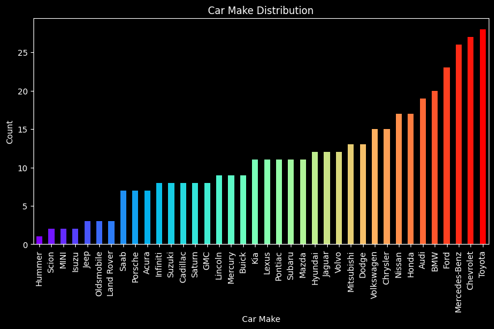

# Car Data Analysis

This project explores a dataset of car specifications and performs various data cleaning, analysis, and visualization tasks.

## Project Overview

The goal of this project is to gain insights into the car dataset and demonstrate fundamental data manipulation techniques using Python and Pandas.

## Steps Performed

1. **Data Loading:** The dataset is loaded from a raw CSV file hosted on GitHub.

2. **Data Cleaning:**
   - Null values in the 'Cylinders' column are replaced with the mean value.

3. **Value Count Analysis:**
   - The distribution of car makes is analyzed using `value_counts()` and visualized with a **bar chart (see image below)**.
   - 

4. **Filtering:**
   - Records with 'Origin' as 'Asia' or 'Europe' are extracted.

5. **Removing Unwanted Records:**
   - Records with 'Weight' greater than 4000 are removed.

6. **Column Manipulation:**
   - All values in the 'MPG_City' column are increased by 3 using a lambda function.

## Libraries Used

- Pandas
- Matplotlib

## How to Run

1. Make sure you have the necessary libraries installed.
2. Replace the placeholder URL with the actual raw URL of your dataset.
3. Run the notebook cells sequentially.

## Future Work

- Explore more advanced data analysis techniques, such as regression or clustering.
- Create interactive visualizations.
- Incorporate additional data sources for a richer analysis.

## Car Make Distribution

**To add the image here, follow these steps:**

1. **Save the bar chart as a PNG file.** You can do this by right-clicking on the chart in your notebook and selecting "Save Image As...".
2. **Upload the PNG file to your GitHub repository.**
3. **Reference the image in the README using Markdown syntax:**
